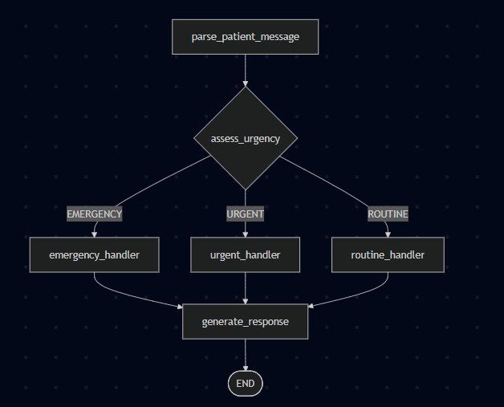
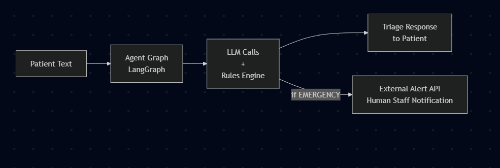

# Agentic AI Project Development Artifacts
### Patient Symptom Escalation Agent

**Author:** Hrishiraj Mitra

---

## 1. Problem Statement

Patients often describe symptoms through chat or text without knowing the severity of their condition. Delays in identifying critical symptoms can lead to poor health outcomes. This project builds an Agentic AI system that reads a patient's free-text message, understands the symptoms described, classifies urgency, routes to the appropriate handler, and generates a suitable response — escalating to emergency services when necessary.

---

## 2. Use Case Definition

**Domain:** Healthcare / Patient Triage  
**Input:** A free-text patient message (e.g., *"I have chest pain and my left arm feels numb"*)  
**Output:** A structured triage response with urgency classification and recommended next action

**The agent must:**
1. Parse and understand the patient's message
2. Assess urgency level — EMERGENCY, URGENT, or ROUTINE
3. Route to the correct handler based on urgency
4. Generate an appropriate, empathetic response
5. Escalate to emergency services or human staff if needed

---

## 3. Agentic AI Architecture

This system is built using **LangGraph**, which models the agent as a stateful directed graph. Each node in the graph is a discrete reasoning or action step. The graph compiles into a runnable agent pipeline.

### 3.1 State Schema (`TriageAgentState`)

The shared state object passed between all nodes. It holds the patient message, extracted symptoms, urgency level, handler notes, and the final response. All nodes read from and write to this object — it is the agent's "working memory."

### 3.2 Graph Nodes

| Node | Role |
|---|---|
| `parse_patient_message` | Extracts symptoms and intent from raw text |
| `assess_urgency` | Classifies into EMERGENCY / URGENT / ROUTINE |
| `emergency_handler` | Triggers escalation, alerts human staff |
| `urgent_handler` | Prepares priority care instructions |
| `routine_handler` | Prepares standard self-care advice |
| `generate_response` | Produces the final patient-facing message |

### 3.3 Routing Logic

After `assess_urgency`, a conditional edge calls `route_by_urgency()` which inspects `state["urgency_level"]` and routes to one of three handlers. All three handlers converge at `generate_response` before the graph ends.

---

## 4. Project Development Artifacts

### 4.1 Requirements Document

**Functional Requirements:**
- Parse free-form patient text and extract symptoms
- Classify urgency into one of three levels: EMERGENCY, URGENT, ROUTINE
- Route to the correct handler node based on classification
- Generate empathetic, contextually appropriate responses
- Support human escalation for EMERGENCY cases

**Non-functional Requirements:**
- Response latency under 3 seconds for non-emergency paths
- Graceful fallback on ambiguous or incomplete input
- HIPAA-aware design — no real patient data in dev/test environments

---

### 4.2 System Design Document

**Components:**

- **LangGraph Agent Graph** — orchestrates the multi-step reasoning flow via `build_graph()` in `graph.py`
- **LLM / Inference API** — backs `parse_patient_message` and `generate_response` nodes (e.g., OpenAI, Anthropic Claude, or a local model via Ollama)
- **Rules Engine** — keyword and pattern matching inside `assess_urgency` for fast, deterministic triage
- **Escalation Service (simulated)** — `emergency_handler` would call an external API (e.g., hospital alert system, SMS gateway) in production
- **Logging & Audit Trail** — every state transition logged for compliance and review

**Data Flow:**

---

### 4.3 Agent Graph Definition (Core Code Artifact)

The `build_graph()` function in `graph.py` is the central artifact of the project. It defines all nodes, edges, the conditional routing function, and compiles the runnable agent. 

---

### 4.4 Node Implementations (`nodes.py`)

Each node function receives the current `TriageAgentState` and returns an updated state dict. Key responsibilities per node:

- `parse_patient_message` → calls LLM to extract symptoms, duration, and severity indicators
- `assess_urgency` → applies keyword rules or LLM classification to set `urgency_level`
- `emergency_handler` → sets escalation flag, logs alert, prepares human handoff context
- `urgent_handler` / `routine_handler` → populate handler-specific notes and advice
- `generate_response` → calls LLM with full state context to produce final reply

---

### 4.5 Test Cases

| Input Message | Expected Urgency | Expected Action |
|---|---|---|
| "I have chest pain and arm numbness" | EMERGENCY | Escalate immediately |
| "I've had a fever for 2 days" | URGENT | Advise GP visit |
| "I have a mild headache" | ROUTINE | Self-care advice |
| "Feeling very dizzy, can't stand" | EMERGENCY | Escalate immediately |
| "Slight sore throat since morning" | ROUTINE | Rest and fluids |

---

### 4.6 Escalation Policy

| Urgency Level | Agent Action | Human Involvement |
|---|---|---|
| EMERGENCY | Escalate immediately, trigger alert API | Required — human responds |
| URGENT | Agent responds, flags for review | Within 1 hour |
| ROUTINE | Fully automated response | Audit log retained |

---

## 5. Steps to Build an Agentic AI App

**Step 1 — Define the Use Case & Agent Boundary**  
Identify what decisions the agent must make, what data it needs as input, and where humans must remain in the loop. For this project: parse symptoms → classify → respond or escalate.

**Step 2 — Design the State Schema**  
Define the shared state object (`TriageAgentState`) that all nodes read and write. This is the agent's persistent working memory across the graph execution.

**Step 3 — Identify Nodes & Tools**  
Map each reasoning step to a node. Decide which nodes call an LLM, which call an external API (alerting, EHR lookup), and which are pure rule-based logic.

**Step 4 — Define Routing Logic**  
Write conditional edge functions like `route_by_urgency()` that inspect state and direct flow. This dynamic routing is what makes the system *agentic* rather than a static pipeline.

**Step 5 — Integrate External Services & APIs**  
Connect to inference APIs (OpenAI, Anthropic, HuggingFace Inference), business APIs (hospital systems, SMS gateways), and any tools the agent needs to act in the real world.

**Step 6 — Compile & Test the Graph**  
Use `graph.compile()` and test with representative inputs. Use LangGraph's tracing to inspect state at every node transition.

**Step 7 — Add Observability**  
Log all state transitions, LLM calls, routing decisions, and escalation events. In a healthcare context this is mandatory for compliance.

**Step 8 — Human-in-the-Loop Checkpoints**  
For high-stakes decisions, add `interrupt_before` checkpoints (supported natively in LangGraph) so a human can review before the agent acts.

**Step 9 — Deploy & Monitor**  
Containerize the agent, expose via a REST API, and monitor latency, fallback rates, escalation frequency, and LLM accuracy over time.

---

## 6. Key Agentic AI Concepts Demonstrated

- **Multi-step reasoning** — the agent does not respond in one shot; it parses, assesses, routes, then responds as separate, purposeful steps
- **Conditional routing** — behavior changes dynamically based on state, not hard-coded logic
- **Stateful execution** — all nodes share and mutate a common state object across the graph
- **Escalation path** — the agent recognizes its own limits and hands off to humans when the stakes are too high
- **Separation of concerns** — parsing, reasoning, and response generation are fully decoupled nodes, making each independently testable and replaceable

---